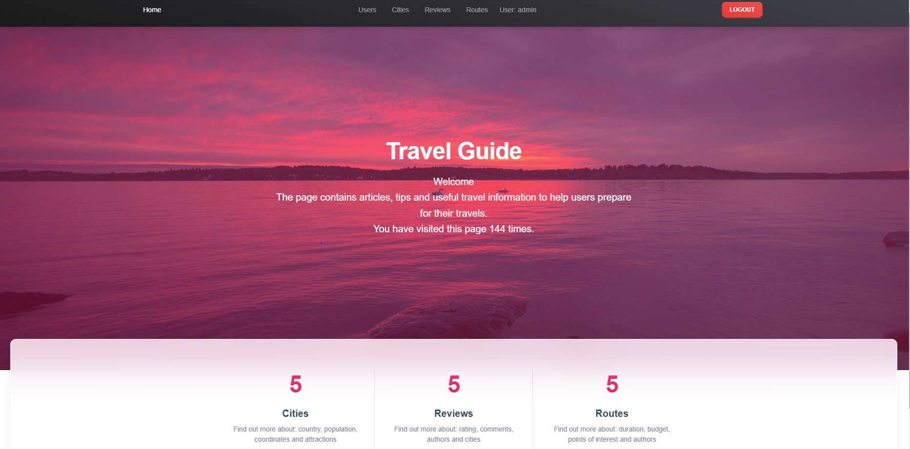

# Travel Guide

The Travel Guide project is a web application designed to provide users with comprehensive information about various cities, attractions, routes, and user reviews worldwide. It serves as a platform for travelers to discover new destinations, plan their trips, and share their experiences with others.

## Check it out!

[Travel-guide project deployed to Render](https://travel-guide-3u2f.onrender.com")

## Installing

Python3 must be already installed

```shell
git clone https://github.com/tiron-vadym/travel-guide.git
cd travel_guide
python -m venv venv
source venv/Scripts/activate
pip install -r requirements.txt
python manage.py runserver
```

## Features

* Manage routes: Add, delete and edit travel routes with a user-friendly interface.

* Reviews and Ratings: Users can leave reviews and rate routes, allowing other users to receive valuable tips and recommendations.

* City management: Add new cities, describe them and add them to routes.

* Authentication and authorization: Secure access to administration functions, ensuring data confidentiality.

* Search and filtering: Quick search and filtering of routes according to various criteria for the convenience of users.

* Pagination: Displaying a list of items as pages to improve page loading speed.


## Demo
